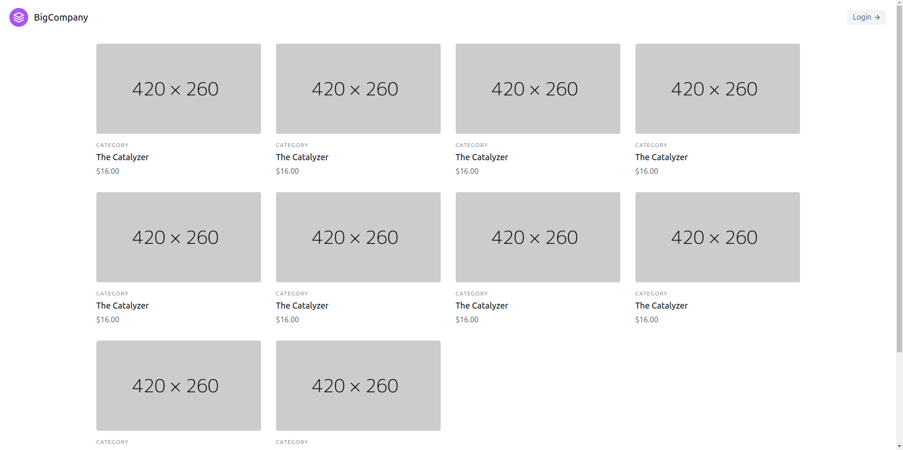
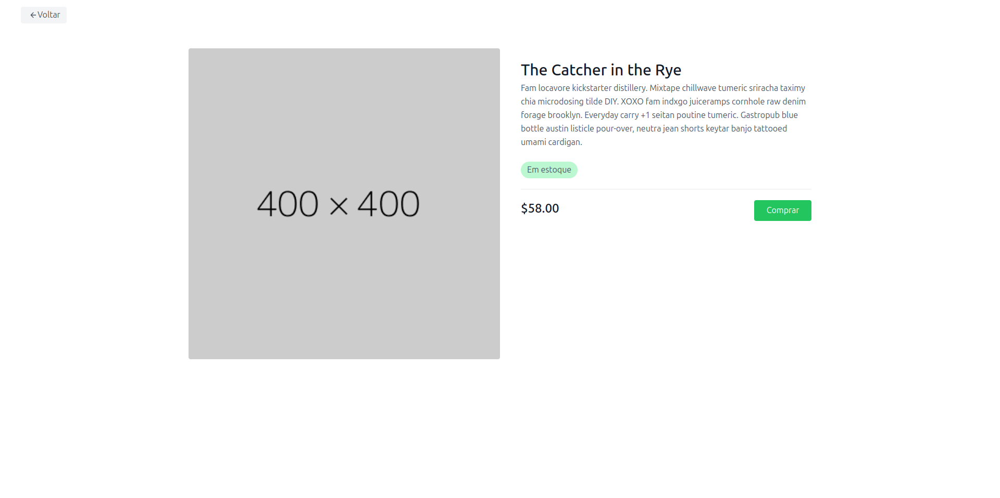
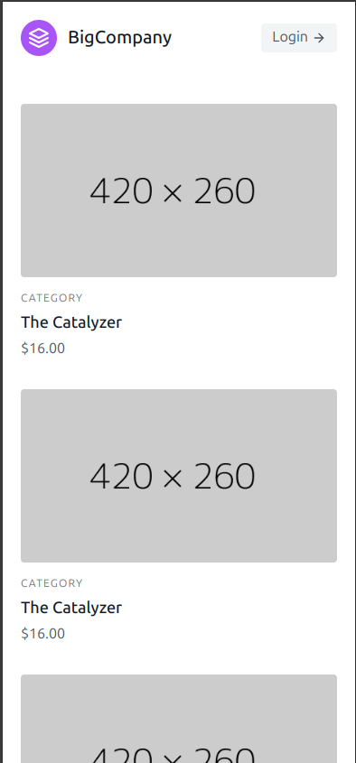
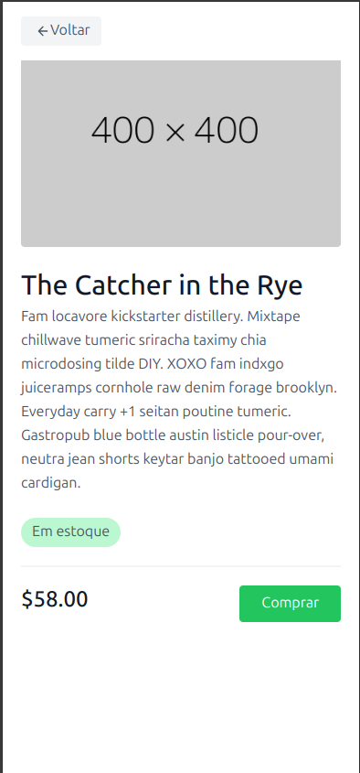

**Project Status:** 
In Development

## About the project 
This is a simple eCommerce application built using laravel on both backend and frontend.
O foco é o uso do _Blade_ para construir o frontend sem o uso de frameworks.

## Technologies
- Laravel
- Blade templates
- TailwindCSS
- Laravel Sail 
- Docker
- MySQL

## Screenshots

### Desktop

  
  

### Mobile

  
  

